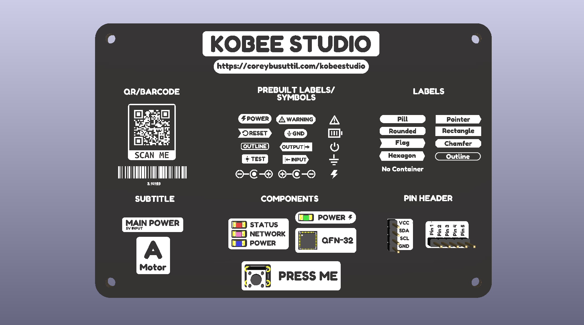
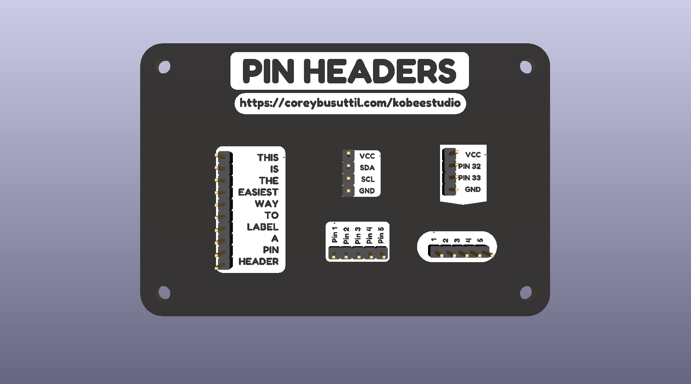
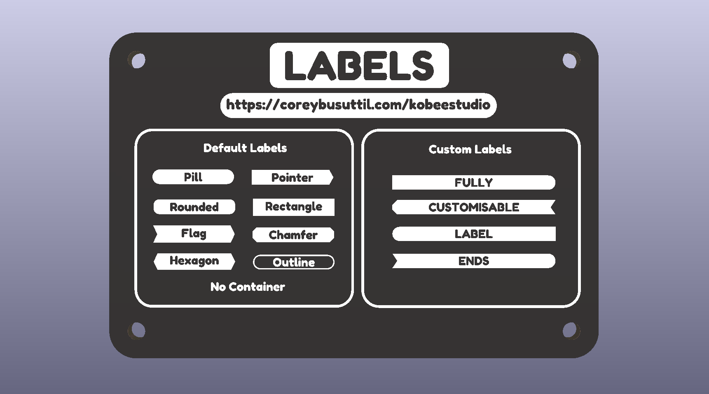
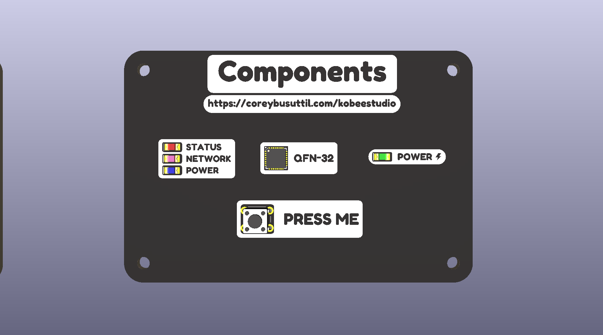
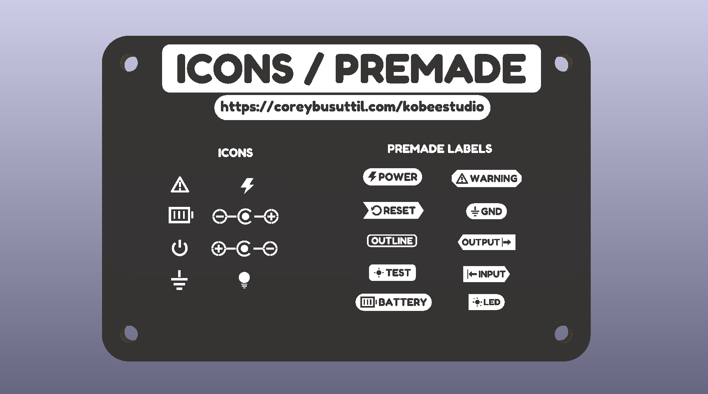
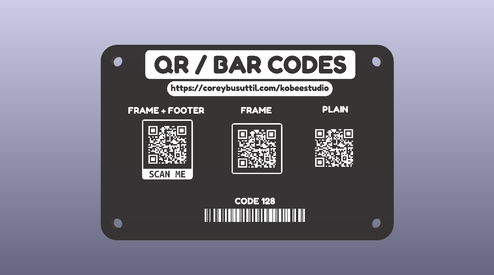

<h1 align="center">Kobee Studio</h1>

<h2 align="center">Modern PCB graphics for KiCad</h2>

  Design beautiful labels, icons, connector overlays and PCB artwork without leaving KiCad.

> **Current status:** **Kobee Studio 1.3.4 is the current stable release**, tested with **KiCad 10 on macOS and Windows**. It uses KiCad's supported IPC plug-in method. Save your PCB before applying new artwork.
> Linux uses the same plug-in package, but still needs full UI and artwork validation, so it is not recommended yet for anything critical. If you test on Linux, bug reports, screenshots, and board files are very welcome.

  

The repository includes the [editable KiCad showcase board](examples/showcase/)
used for this render, with labels, symbols, component callouts, component
arrays, connector overlays, machine-readable codes and multilayer artwork.

---

## Why?

The goal of **Kobee Studio** is to create a complete toolkit for PCB graphics, bringing together text, labels, icons, connector overlays, branding, artwork and reusable design systems into a single, seamless workflow, all while keeping everything fully editable inside KiCad.

Kobee Studio began as a fork of **[KiBuzzard](https://github.com/gregdavill/KiBuzzard)** by Greg Davill, originally created to add features and workflow improvements I wanted for my own PCB design process. Since then, it has evolved far beyond its origins, with significant new functionality, much finer control over generated graphics, and support for KiCad's modern API, positioning it for KiCad 11 and beyond.

The long-term vision is for Kobee Studio to become the go-to graphics toolkit for KiCad, a single plugin that provides everything needed to create beautiful, consistent and professional looking PCBs without leaving the editor.

## What’s in 1.3.4

| Tool                 | What it does                                                                                                    |
| -------------------- | --------------------------------------------------------------------------------------------------------------- |
| Labels               | Filled, inverted and outline labels with flexible shapes, padding, borders and mixed ends.                      |
| Icons & quick labels | Searchable PCB-safe symbols and common labels, usable standalone or with text.                                  |
| Header overlays      | Pin labels for single-row 2.54 mm headers, with clearances, openings and editable layout.                       |
| QR & barcodes        | QR codes and compact Code 128 markings with fabrication-minded size checks.                                     |
| Component callouts   | Labels that frame packages, switches and LED arrays while keeping the component clear.                          |
| Layers               | Front/back silk, copper and solder-mask artwork.                                                                |

Everything lands as an ordinary, editable KiCad footprint. Kobee Studio never changes the electrical footprint underneath it.

Need a hand while you work? Use **Need help?** in the top-right of the editor to open the [Kobee Studio docs](https://www.coreybusuttil.com/kobeestudio/docs/) for installation, tutorials and practical guidance.

# Features

---

Generate artwork on:

- Front Silkscreen, Bottom Silkscreen, Front Copper, Bottom Copper, Front Solder Mask, Bottom Solder Mask

## Header Overlays

Generate configurable connector overlays in seconds.

Current support: 2.54 mm single-row headers

Features: Automatic pin labels, Configurable plug clearance, optional openings

---

## Parametric Labels

Generate labels with configurable containers. Supported shapes include:

- Rounded rectangles, Pills, Flags, Tabs, Pointers, Chamfers, Hexagons

Every label supports:

- Fill, Outline, Border width, Padding, Corner radius, Independent end styles and an optional underline
- Quick insertion of useful special characters, including forward slash and backslash

Generated artwork remains fully editable inside KiCad.

---

## Component callouts

Component callouts create a clear label around a real component without changing its electrical footprint. Start with a common passive, LED or tactile-switch envelope, or enter custom dimensions when the package is unusual. Kobee Studio keeps a configurable safe zone around the part, then places the label and optional symbol on the chosen side.

For repeated parts, **Component Array** extends the same idea into a vertical stack or horizontal row, with editable pitch and one label per component. It is useful for LED banks, status indicators and other repeated board features that need to stay easy to identify.

---

## PCB Icons

> **🚧 Work in Progress:** The icon picker is functional, but the icon library is still being validated. Some icons may require refinement to ensure they render correctly and produce reliable silkscreen output on manufactured PCBs.

Kobee Studio includes a growing collection of PCB-safe icons.

Current icons include:

- Ground, Power, LED, Battery, Warning, Input, Output, Test Point, Polarity

* Many More

Icons can be used: Standalone, Beside text, Inside labels

---

## QR Codes and Barcodes

Generate machine-readable PCB artwork directly from a payload.

- QR Codes use automatic error-correction sizing and a protected four-module quiet zone.
- QR presentation can be plain, placed in a rounded frame, or use a rounded frame with an optional negative footer such as **SCAN ME**. Extra frame spacing is adjustable down to zero without reducing the protected quiet zone.
- Code 128 uses compact 0.25 mm modules and 4.0 mm bars by default, with guarded minimums of 0.20 mm and 3.0 mm.
- QR codes and barcodes can show a separate editable line of human-readable text below the generated code. The printed text does not change the encoded payload.

Small codes should always be checked against the chosen PCB finish, fabricator capabilities and the scanner that will be used.

---

# Roadmap

Kobee Studio is growing beyond labels into a complete PCB graphics toolkit.

Ive started to create a more robust **[Roadmap](https://github.com/mrcpuddington/kobeestudio/blob/main/ROADMAP.md)** which will be updated as time goes on

---

# Install Kobee Studio — KiCad 10

Kobee Studio is a KiCad plugin, not a footprint library.

### Install the current release

Kobee Studio 1.3.4 uses KiCad's supported IPC plug-in method and is the
recommended release for KiCad 10 on macOS and Windows.

1. Download `Kobee-Studio-1.3.4-pcm.zip` from the [Kobee Studio 1.3.4 release](https://github.com/mrcpuddington/kobeestudio/releases/tag/v1.3.4). Do not unzip it.
2. Open KiCad's **Plugin and Content Manager** and choose **Install from File…**.
3. Select the downloaded ZIP and approve the install.
4. Open a board in PCB Editor, then choose **Tools → External Plugins → Kobee Studio: Create PCB Artwork**. The Kobee Studio toolbar button can also be enabled from PCB Editor's **Preferences/Settings → Action Plugins** page.

If the toolbar button does not appear:

1. Fully quit PCB Editor and open it again.
2. Open PCB Editor's **Preferences/Settings → Action Plugins** page and make sure **Show Button** is enabled for **Create PCB Artwork**.
3. Use **Refresh Plugins**, then restart PCB Editor.

More installation help is available in the [Kobee Studio docs](https://www.coreybusuttil.com/kobeestudio/docs/).

### Testing releases

Kobee Studio testing releases are built and published by the release workflow.
Install them from the testing PCM repository or the attached release asset;
there is no local package-build step for testers.

### Platform support

| Platform | KiCad version | Status                                           |
| -------- | ------------- | ------------------------------------------------ |
| macOS    | KiCad 10      | 1.3.4 tested working release                      |
| Windows  | KiCad 10      | 1.3.4 tested working release                      |
| Linux    | KiCad 10      | Install path documented; full validation planned |

---

# Help and contributing

For installation help, tutorials and practical Kobee Studio guides, visit the [Kobee Studio docs](https://www.coreybusuttil.com/kobeestudio/docs/).

Bug reports, ideas and pull requests are always welcome through Github. If you build something cool with Kobee Studio, I'd genuinely love to see it.

---

# Acknowledgements

Kobee Studio builds upon the work of some fantastic open-source projects.

Special thanks to:

- **Greg Davill** for creating **[KiBuzzard](https://github.com/gregdavill/KiBuzzard)**.
- **SparkFun** for the original **Buzzard** project.
- The **Interactive HTML BOM** contributors.
- The **FontTools** contributors.
- The **svg2mod** contributors.

Without their work, Kobee Studio wouldn't exist.

---

# License

Kobee Studio is distributed under GPL-2.0-only (GNU GPL version 2 only), a GPL-compatible open-source licence suitable for KiCad Python-plugin distribution. It incorporates MIT-licensed KiBuzzard material and retains Greg Davill’s original copyright and MIT permission notice alongside all other third-party notices.

See [LICENCE](LICENCE) and [THIRD_PARTY_NOTICES.md](THIRD_PARTY_NOTICES.md) for the complete notices.
